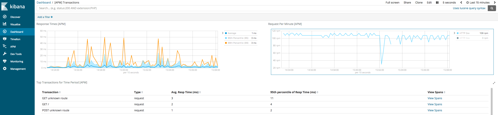

# Monitor nodejs application (Express) with elastic APM

-   [Node.js express](https://www.elastic.co/guide/en/apm/agent/nodejs/current/express.html)

## To build

You build the container by running:

    make

Or if you don't have make installed:

    docker build . -t jecnua/monitor-nodejs-elasticapm

You will also need to build the APM server before running the tests :)

    docker build apm-server/ -t jecnua/nodejs-monitor-testapp-apm-server

## Run all the containers

(OPTIONAL) In case you didn't already build the container:

    make build

To run the local test environment:

    make run

This will take a while since it needs to pull down all the dependencies and
wait for them to start.

## Test by creating some load

Add some load:

    while true; do curl localhost:3000; sleep .0$[ ( $RANDOM % 10 ) + 1 ]s; done

Add some errors:

    while true; do curl 'localhost:3000/error'; sleep $[ ( $RANDOM % 3 ) + 1 ]s; done

## Delete it

    make clean

# TODO

-   Test all json
-   Test docker
-   Add hadolint check on all dockerfile
-   Add grafana
-   Update to node 8
-   Add apm on dependencies not dockerfile
